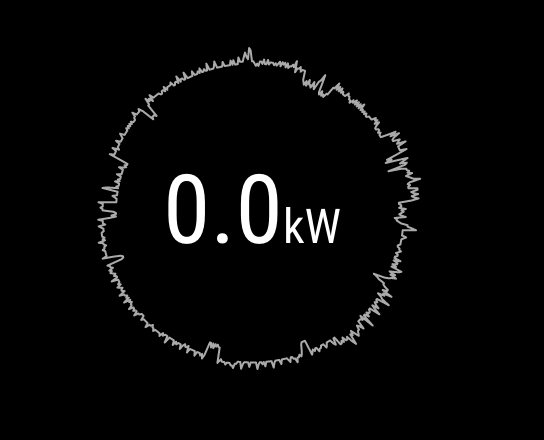

IoTaWatt is a module for [looking glass](http://github.com/glasslabs/looking-glass) displaying data from an [IoTaWatt](https://www.iotawatt.com/)



## Usage

Add the configuration as shown below to your configuration:

```yaml
modules:
 - name: simple-iotawatt
   path: github.com/glasslabs/iotawatt
   position: bottom:left
   config:
     url: http://your-iotawatt-url/
     inputs:
       - stove
```

## Configuration

### URL (url)

*Required*

The base url of your IoTaWatt.

### Inputs (inputs)

*Required*

The list of inputs and outputs to monitor.
